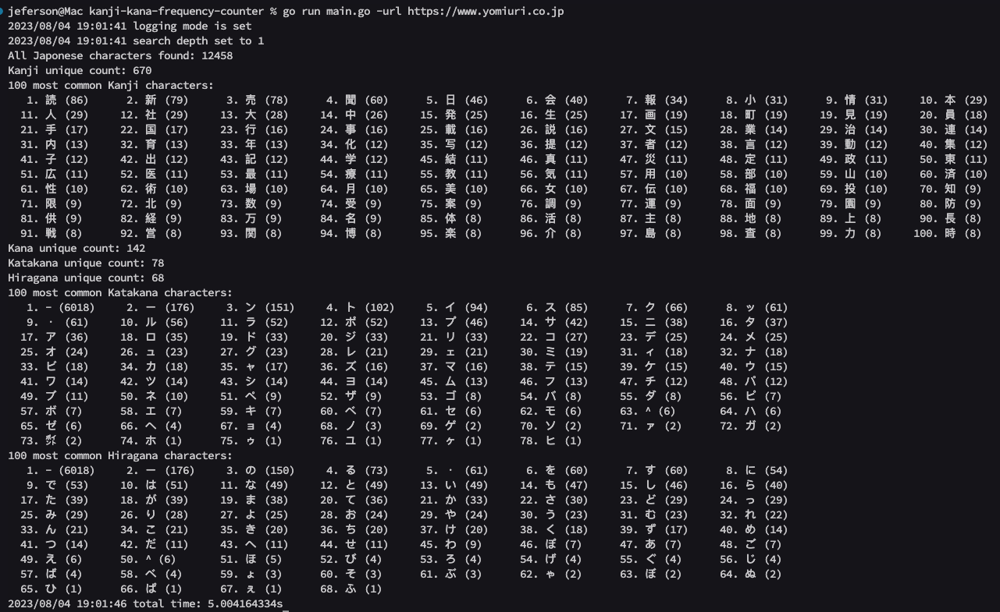

# kanji-kana-frequency-counter

Find the most common kanji and kana characters on a website using this scraping script.

# Usage

```go
go run main.go -url https://www.yomiuri.co.jp
```


Kanji-Kana Frequency Counter Output


